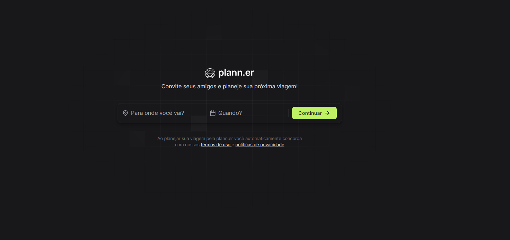
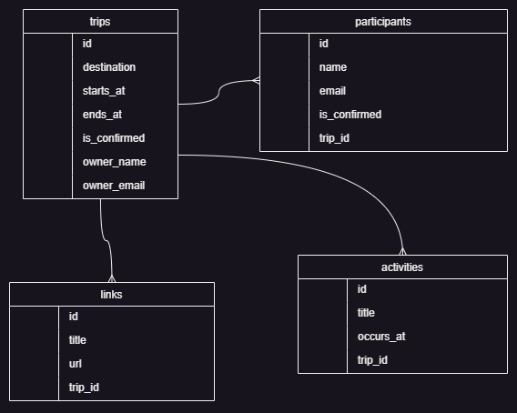
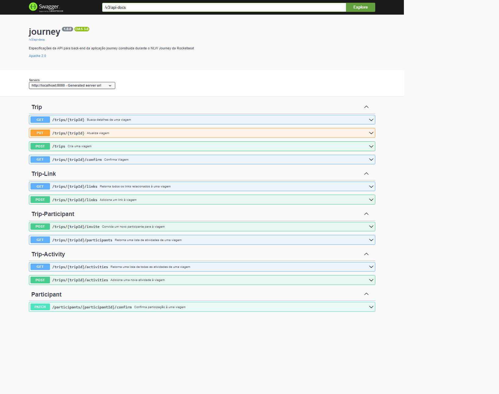
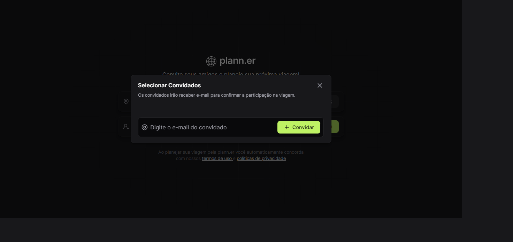
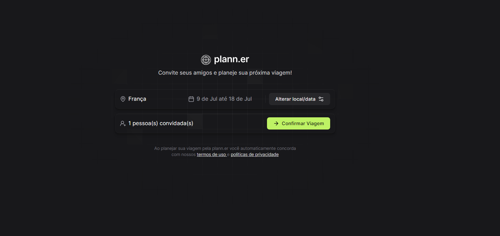
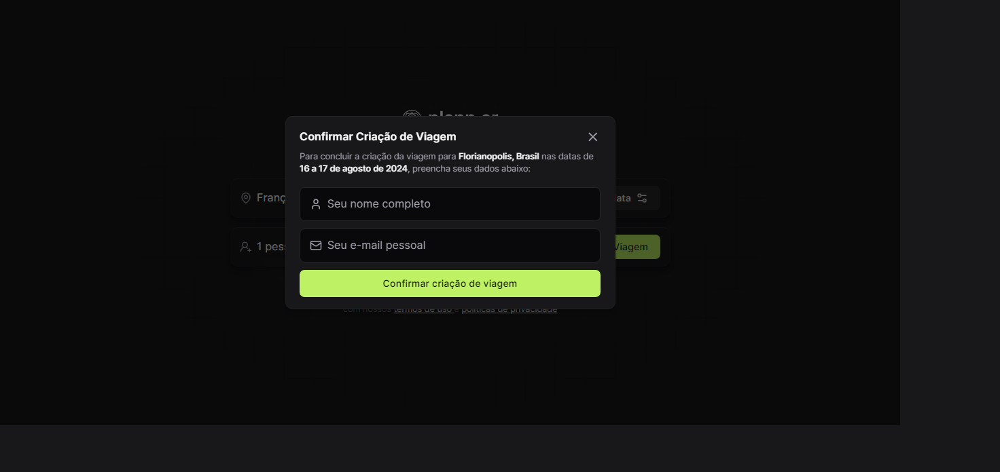
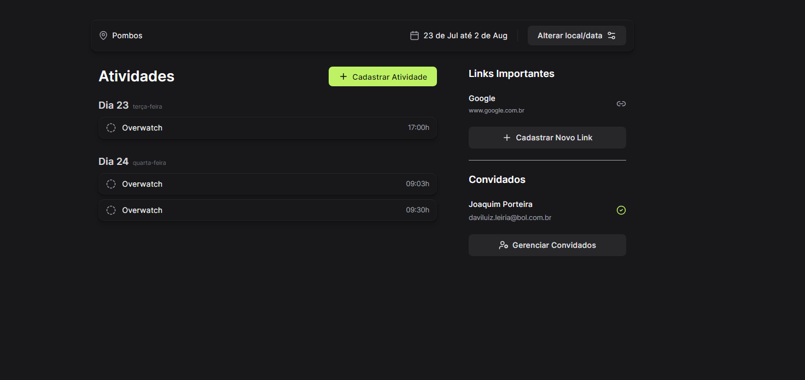
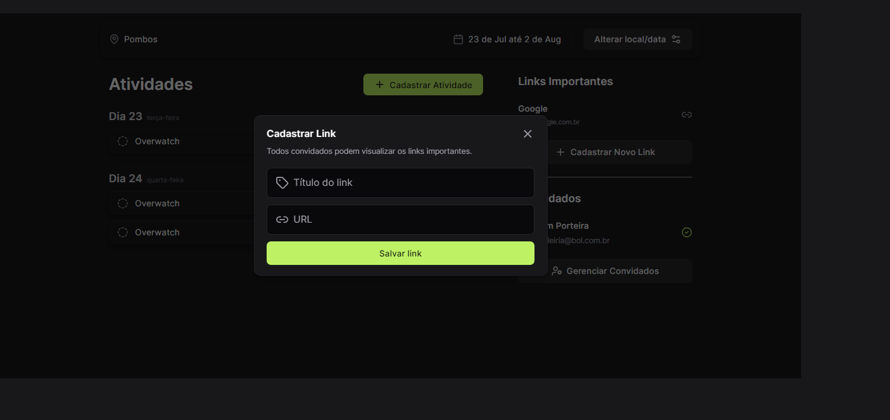
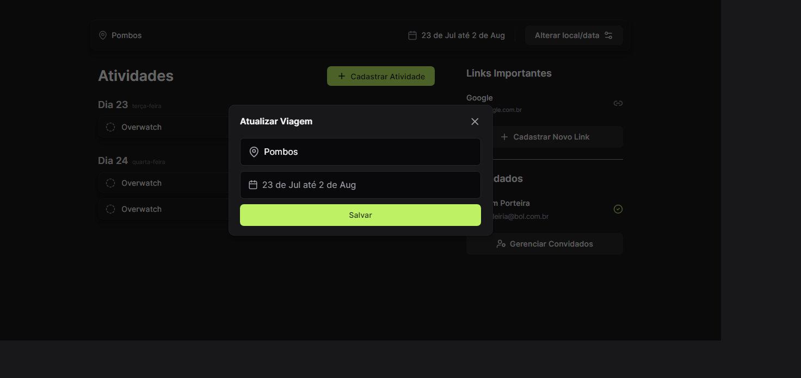
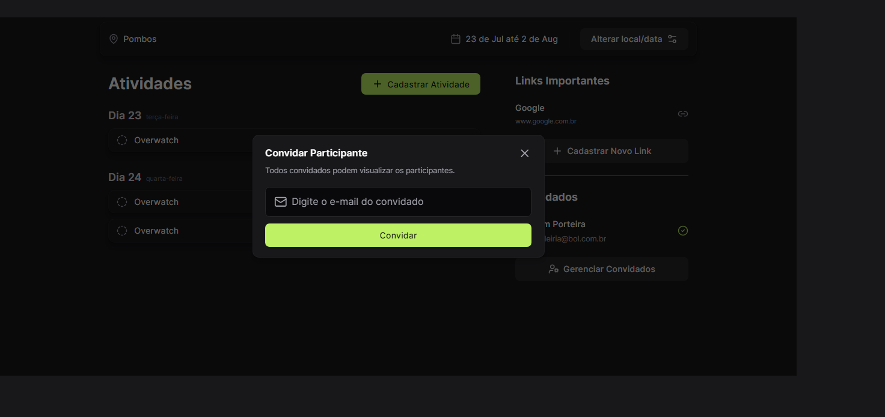

<h1 align="center"> NLW Journey </h1>

Evento exclusivo e gratuito, promovido pela Rocketseat para ensino de tecnologias Front-end, Back-end, GO, mobile.

  

  

## 🚀 Tecnologias

Esse projeto foi desenvolvido com as seguintes tecnologias:

- Web
  - React
  - Tailwindcss
  - Typescript
  - Lucide-react
  - dayjs
  - React Router
  - Tailwind Variants
  - React DayPicker
  - Axios
- Back-end
  - Java 17
  - Spring Boot Framework
  - Spring Validation
  - h2 -> database
  - Faker -> seed database
  - Flyway
  - Spring Doc -> Swagger
  - Rest Assured -> testes
  - Spring Mail
  - mailpit
- Mobile
  - React Native
  - Typescript
  - nativewind
  - lucide
  - clsx
  - expo blur
  - AsyncStorage
  - dayjs
  - zod
  - axios

## 💻 Projeto

> O projeto Journey tem como objetivo ajudar o usuário a organizar viagens à trabalho ou lazer. O usuário pode criar uma viagem com nome, data de início e fim. Dentro da viagem o usuário pode planejar sua viagem adicionando atividades para realizar em cada dia.
>

## 📝 Requisitos

### Requisitos funcionais

1. O usuário cadastra uma viagem informando o local de destino, data de início, data de término, e-mails dos convidados e também seu nome completo e endereço de e-mail;

2. O criador da viagem recebe um e-mail para confirmar a nova viagem através de um link. Ao clicar no link, a viagem é confirmada, os convidados recebem e-mails de confirmação de presença e o criador é redirecionado para a página da viagem;

3. Os convidados, ao clicarem no link de confirmação de presença, são redirecionados para a aplicação onde devem inserir seu nome (além do e-mail que já estará preenchido) e então estarão confirmados na viagem;

4. Na página do evento, os participantes da viagem podem adicionar links importantes da viagem como reserva do AirBnB, locais para serem visitados, etc...

5. Ainda na página do evento, o criador e os convidados podem adicionar atividades que irão ocorrer durante a viagem com título, data e horário;

6. Novos participantes podem ser convidados dentro da página do evento através do e-mail e assim devem passar pelo fluxo de confirmação como qualquer outro convidado
   

## 🖼 ERD Driagrama

  

## 🖼 Documentação com Swagger

  

## 🖼 ScreenShot Web

  
  
  
  
  
  
  
  

## 🖼 ScreenShot Mobile

OBS: emulador não funcionou, com isso, toda a parte mobile foi testado com o celular fisico, sem scrennshot. 😥

## ✍ Licença

Esse projeto está sob a licença MIT.
